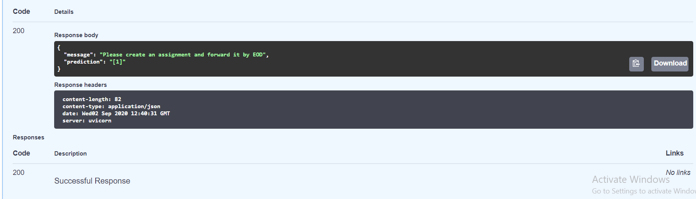

# Classifying actionable sentences from email data




To reproduce the environment : 

```
conda create --name <env> --file <requirements.txt>
```

Then download the spacy model if needed : 

```
python -m spacy download en_core_web_sm
```

To run the [fastapi](https://fastapi.tiangolo.com/) api : 

```
uvicorn app:app --reload
```

* To interact with the API go to : http://127.0.0.1:8000/docs as Fastapi provides a great interface for interacting with REST API's. 

* The trained models are under the models folder. Instead of using command line scripts I went to API route because I wanted to pick up Fastapi. 
* All models were trained in notebooks. Notebooks are under the notebook folder.

# Scripts 

* ```email_to_sentences.py``` converts enron email dataset to a pandas series object containing list of sentences. Description in [Preprocessing](#Preprocessing) section. To run this script download the enron dataset from kaggle and put the ```emails.csv``` file under the data section.
* ```rule_model.py``` has the rule based model.  Described in [Rule Based Model](#Rule-Based Model) section.
* ```merge_huddle_data.py``` merges the given action items with the sentences I got from emails. For merging I first applied the rule based model to first five thousand sentences (after shuffling the data) of enron emails, then took only the items marked as non-actionable as negative input and the positive labels came from the data given to me. So after combining I had 3952 sentences in total, out of which 1250 were positive.
* ```app.py``` has the fastapi app. Here the naive bayes, svm, logreg model were loaded as scikit-learn saved pipeline objects via joblib and the lstm model was saved as a h5 file. For the LSTM model I also had to save the tokenizer and some hyperparameters like the sequence length and truncation type for padding. The four options for the model are  : ```rule-based,naive bayes,svm,logreg``` . Since LSTM model showed best performance I kept the LSTM model as the default.
* I was not sure if any results from the rulebased model on the merged dataset would be valid or not because I took the predictions from this model as data for the merged dataset to begin with since only positive sentences were provided.


# Instructions

> The following are the details of the assignment.
>
> **Objective1**: Create a heuristic-based linguistic model for detecting actionable items from emails i.e. a rule-based model to classify sentences to actionable sentences and non-actionable sentences.
>
> This step also needs you to ***download the dataset*** and ***preprocess the emails\*** and break them into ***meaningful sentences\***.
>
> **Objective2**: Once done with Objective1 ping for some pre-tagged action item sentences (One label only). Then train a model to detect whether a given sentence is an actionable item or not. 
>
> ***NB: You will be given ONLY the action item sentences, you might need to use your model from objective 1 to get the Non-actionable sentences.***
>
> Actionable item => A sentence which asks someone to do something
>
> example: "Please create an assignment and forward it by EOD"
>
> **About data set:**
>
> The data set contains below 1 CSV file:
>
> 1.Enron email dataset
>
> **Download** dataset from the following link.
>
> https://www.kaggle.com/wcukierski/enron-email-dataset
>
> \-------------------------------------------------------
>
> ## Delivery
>
> Please create a **private** repository in Github and share it with git userid x. We ABSOLUTELY should be able to see your check-ins/commits from the beginning and NOT just a single commit at the end. Include instructions on how to run the project and set up the requirements. Kindly, ensure that the entire project is repeatable from scratch i.e. from raw data to the final model.
>
>  
>
> Explain the following things in README of Github
>
>   1) Explain your project pipeline.
>
>   2) Explain in detail the process of feature extraction.  
>
>   3) Report recall, precision, and F1 measure
>
>   4) Explain the challenges you've faced while building the model.
>
> 
>
> 2. DO NOT upload the dataset to the repository. Your heuristic model should be runnable. i.e. either as:
>
>    a.   A CLI script that accepts arguments to pass a filename or single record input.
>
>    b.   A web service with a POST request.
>
> 3. Ensure you have documentation in the README.md for us to be able to use the code against the data and also describe arguments/schemas where necessary.
> 4. Ensure that your development environment is fully reproducible.
> 5. PFA, actions.csv .The dataset contains ONLY actionable sentences.
> 6. Ensure that all training pipelines are reproducible and that the models are runnable as a service/CLI script.
>

# To do 

* [x] Extracting email content
* [x] Tokenizing emails to list of sentences
* [x] Making the list of keywords
* [x] Depending on the keywords making a dataset with labels set
* [x] Asking for labelled text from company
* [x] preprocessing for text classification models, merging company given data with rule based labelled ones
* [x] making a text classification pipeline end to end
* [x] add data merging code from rule based model and given data
* [x] add modelling notebook. current models : 
  * [x] naive bayes
  * [x] svm
  * [x] logistic regression
  * [x] lstm (no pretrained embedding)
* [x] save all models and test loading
* [x] Try all models with lemmatizing.
* [x] exposing all models with fastapi 

# Preprocessing

Enron email dataset was given as the main dataset for the take home challenge. From the raw email strings the content text was extracted using ```email``` package from python built-in library. Then I tokenized the emails to sentences and did some cleanup including stripping white text, taking sentences with more than 5 word length and also filtered based on some keywords like subject lines from email. Ultimately 5861325 individual sentences were extracted from 1.2 GB Enron dataset. [Spacy sentencizer](https://spacy.io/api/sentencizer/) was also attempted for more accurate sentence tokenization, but its pretty slow. I also removed newline and tab characters.

# Rule-Based Model

According to [1](https://www.microsoft.com/en-us/research/wp-content/uploads/2016/06/ActionableItem_camera-ready-1.pdf) and [2](https://pdfs.semanticscholar.org/beed/b0bac9657fe61dd3910c411aa45b49e57f96.pdf) actionable items in meetings would include discussions on scheduling, emails, action items, and search. keywords used in this paper combined with some brainstormed ones :  

```python
keywords = ["find email","send email","respond","check","plan","create reminder", "find calendar entry","search","add agenda item","create calendar entry","open agenda", 
            "send email","find email","make call","open setting","assign","deliver","suggest","order","request","create assignment","forward","tag","todo","call me","call us","give us a call","email"]
```

If there's a keyword present in the sentence we declare it as action sentence. If the sentence is a question even then it can be an action sentence, for example "Would you like to....?", but in this case we also validate that the sentence is legible and long instead of being something like "Sup?". This is the second rule.

For the third rule I initially considered extracting verb phrases, but there are way too many variations. So I used textacy's information extraction module to get the subject-verb-object triplets from the sentences ```textacy.extract.``subject_verb_object_triples``` . It gets results like "I, would like, suggest,..." after extracting triplets. So if the result is non empty we declare a sentence as actionable.


# Models

Initial experiments were run with minor text preprocessing like removing quote strings(""), later set of experiments used lemmatization with ```nltk.WordNetLemmatizer ``` and ```texthero``` package for cleaning up data (removing punctuation, brackets, diacritics, whitespace, digits). Results are given below. After preprocessing the text is converted to vectors with tf-idf in all cases. It seemed preprocessing actually worsened the scores, but it's probably because the dataset I"m using is small. I tried Naive Bayes, SVM, Logistic Regression and LSTM without pretrained embeddings for now. I'd try to use pretrained embeddings like FastText/Glove and try 1D CNNs in general, but for now I focused more on the end to end pipeline instead of modelling. 

# Results

Training: 

| Model                              | Precision | Recall | F1   |
| ---------------------------------- | --------- | ------ | ---- |
| Naive Bayes                        | 0.96      | 0.83   | 0.89 |
| SVM                                | 0.92      | 0.81   | 0.86 |
| Logistic Regression                | 0.94      | 0.81   | 0.87 |
| LSTM(without pretrained embedding) | 0.97      | 0.99   | 0.98 |

Validation  : 

| Model                               | Precision | Recall | F1   |
| ----------------------------------- | --------- | ------ | ---- |
| Naive Bayes                         | 0.91      | 0.60   | 0.73 |
| SVM                                 | 0.88      | 0.77   | 0.82 |
| Logistic Regression                 | 0.89      | 0.76   | 0.82 |
| LSTM(Without pretrained embeddings) | 0.82      | 0.86   | 0.84 |

### With Preprocessing + Lemmatization : 


| Model                              | Precision | Recall | F1   |
| ---------------------------------- | --------- | ------ | ---- |
| Naive Bayes                        | 0.95      | 0.84   | 0.89 |
| SVM                                | 0.91      | 0.76   | 0.83 |
| Logistic Regression                | 0.93      | 0.75   | 0.83 |
| LSTM(without pretrained embedding) | 0.99      | 1      | 0.99 |

Validation  : 

| Model                               | Precision | Recall | F1   |
| ----------------------------------- | --------- | ------ | ---- |
| Naive Bayes                         | 0.83      | 0.62   | 0.71 |
| SVM                                 | 0.87      | 0.73   | 0.79 |
| Logistic Regression                 | 0.89      | 0.71   | 0.79 |
| LSTM(Without pretrained embeddings) | 0.74      | 0.80   | 0.77 |

# Challenges

* Raw data had raw email strings only. Content had to be extracted from raw emails. Discarded other metadata because in the tagged dataset only tagged sentences will be given.  
* I first tried to tokenize the raw emails to sentences using spacy, but spacy sentence tokenizer is very slow with the large spacy model so did it with basic split methods hardcoded. 
